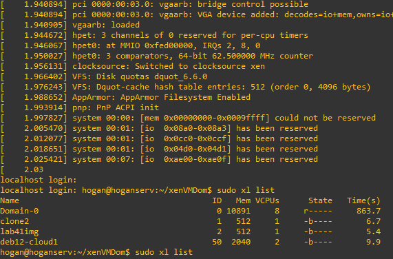
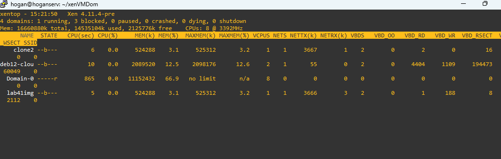
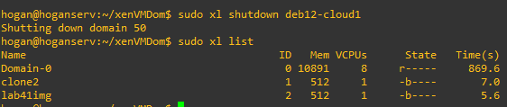
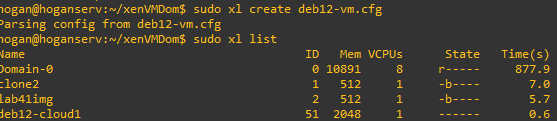

## Pt 1 (10%):

### Xen Setup:

### dom0:

#### Hypervisor:

#### Toolstack:

#### Boot To Xen:


### Bridge

#### Network evidence:

#### Guest Bridge:

#### show ssh working:


## Pt 2 (15%):

### QEMU:

#### QEMU OS Setup:

wget https://cloud.debian.org/images/cloud/bookworm/20260821-2577/debian-12-generic-amd64-20260821-2577.qcow2

qemu-img create -F qcow2 -b debian-12-generic-amd64-20260821-2577.qcow2 -f qcow2 disk-deb12-cloud-u1.qcow2 4G 
this creates a qemu image called disk-deb12-cloud-u1 that can grow up to 4G via qcow2 format (qcow2 delays allocation until its actually needed making the 20G act as a limiter instead of a hard size.) with debian-12 generic installed onto the image.

qemu-img create -f raw disk-swap.img 1G
this creates a disk-swap image for the xen cfg


### Guest Domains (2):

#### Xen QEMU config:
```
## NAME - TYPE
name = 'deb12-cloud1'

# type of guest - here Hardware Virtual Machine
type = 'hvm'
boot = 'c'

## CPU - RAM
vcpus = 2
memory = 2048

## DISKs
disk = [
    '/home/hogan/xenVMDom/disk-deb12-cloud-u1.qcow2,qcow2,xvda',
    '/home/hogan/xenVMDom/disk-swap.img,,xvdb',
]

## NETWORK
# if you don't set a MAC address for a vif, xl will set a new one each boot,
# so adjust your guest network config accordingly
vif = [
       'bridge=xenbr0,mac=90:b1:1c:83:14:9f,vifname=deb-cloud0'
]

on_poweroff = 'destroy'
on_reboot = 'restart'
on_crash = 'restart'

serial = 'pty'

```
#### Guest QEMU Active:




#### Shutdown/restart and guest recovery Management



#### Troubleshooting notes.
A lot of time was spent debugging the cfg file. I ended up sifting through xen logs until I figured out that I messed up the pathing in the initial qemu-img create.
I moved everything over to a new directory and rebased the qcow2 file and it worked.
qemu-img rebase -u -b /home/hogan/xenVMDom/debian-12-generic-amd64-20260821-2577.qcow2   /home/hogan/xenVMDom/disk-deb12-cloud-u1.qcow2


## Pt 3 (15%): 

### Automation script for pt 2:


## Pt 4 (15%):

### Ip forwarding + iptables

#### Presistent nat rules:

#### Reversibility:

#### Parameterized interface name:


## Pt 5 (20%):

### Deploy Apache On Guest 1:

### Deploy SQL on Guest 2:

### Deploy webpage with both guests talking to each other:

## Pt 6 (10%):

### Evaluate QEMU VS LVM