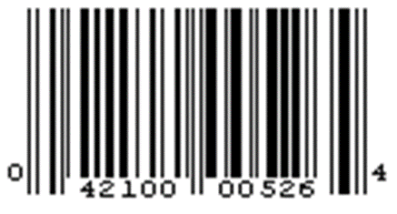

# Checksum

## Check Digits
Check digits are used to confirm data accuracy.

i.e.
sum up binary value of a data chunk
send data and the checksum
receiver performs same sum calc on the data
if receiver sum != original sum. Something went wrong

## Checksum Standards

### Universal Product Code
{ width=50% }
Has a 12 digit number
the last digit is the check digit gotten via mod 10 operation

UPC Number -> N1 N2 N3 N4 N5 N6 N7 N8 N9 N10 N11 N12

N12 = -1(3 * N1 + N2 + 3 * N3 + N4 + 3 * N5 + N6 + 3 * N7 + N8 + 3 * N9 + N10 + 3 * N11) mod 10